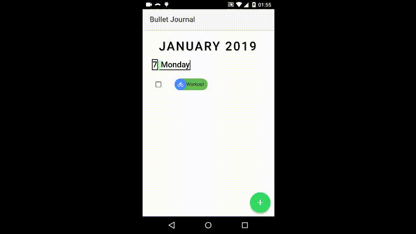

# Angular-Ionic3-Bullet-Journal
Angular Ionic 3 + Sqlite To-do task manager



## Getting Started

Instructions on how to run on an android device.

### Prerequisites

Install:

-Android Studio

-Java SDK

You must have an android device or android emulator.

### Installing

```
npm install
ionic cordova run android
```
